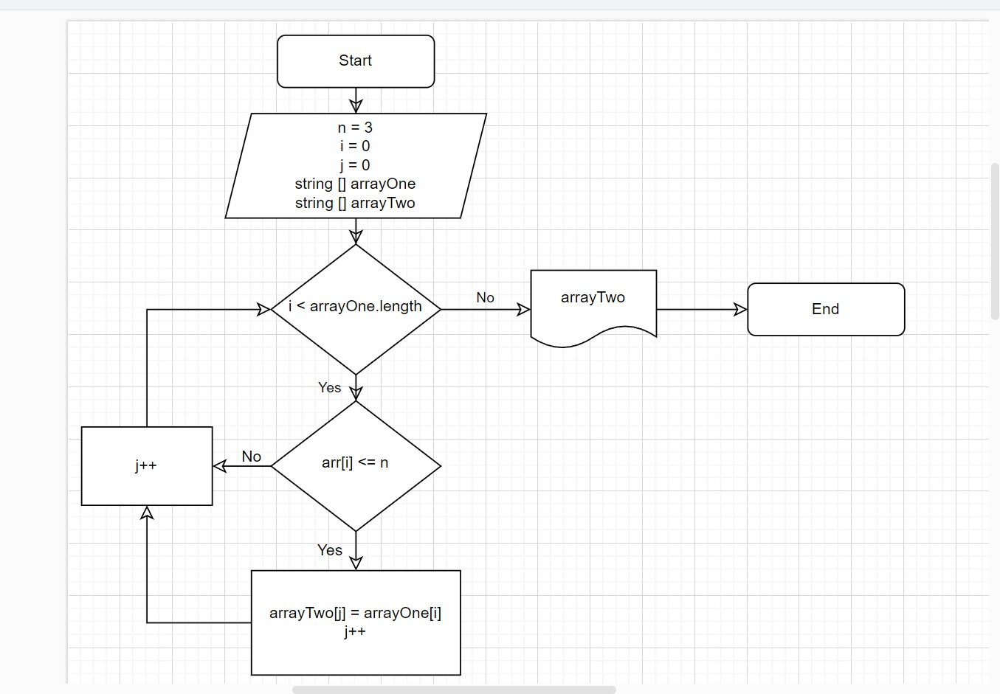

# Итоговая контрольная работа по основному блоку

## Перечень условий для выполнения

* Создать репозиторий на GitHub
* Нарисовать блок-схему алгоритма (можно обойтись блок-схемой основной содержательной части, если вы выделяете её в отдельный метод)
* Нарисовать блок-схему алгоритма (можно обойтись блок-схемой основной содержательной части, если вы выделяете её в отдельный метод)
* Написать программу, решающую поставленную задачу
* Использовать контроль версий в работе над этим небольшим проектом (не должно быть так, что всё залито одним коммитом, как минимум этапы 2, 3, и 4 должны быть расположены в разных коммитах)

**Задача**:
*Написать программу, которая из имеющегося массива строк формирует новый массив из строк, длина которых меньше, либо равна 3 символам. Первоначальный массив можно ввести с клавиатуры, либо задать на старте выполнения алгоритма. При решении не рекомендуется пользоваться коллекциями, лучше обойтись исключительно массивами.*

**Примеры**:
*[“Hello”, “2”, “world”, “:-)”] → [“2”, “:-)”],
[“1234”, “1567”, “-2”, “computer science”] → [“-2”],
[“Russia”, “Denmark”, “Kazan”] → [].*

## Выполнение

1. Создан первый строковый массив
2. Создан метод заполнения массива рандомными элементами
3. Создан метод вывода первого массива
4. Создан метод поиска количества элементов второго массива (т.е. определение размера второго массива)
5. Создан вывод сообщения об отсутствии элементов, удовлетворяющих условию задачи, для создания второго массива
6. Создан метод переноса элементов, соответствующих условию задачи, во второй массив
7. Реализован вывод на экран нового массива из строк, длина которых < или = 3 символам.

## Блок - схема задачи

При помощи *drawio* создана блок-схема решения задачи

